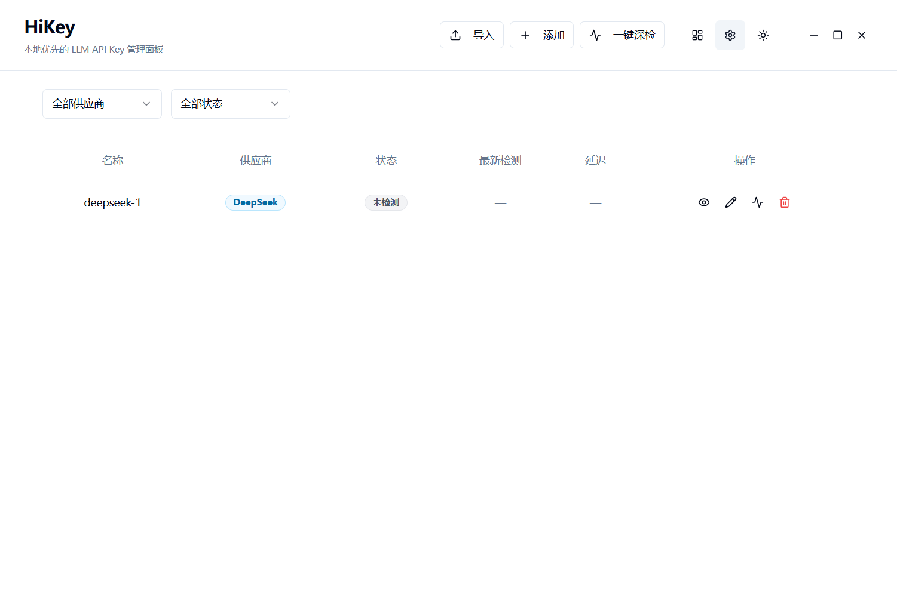
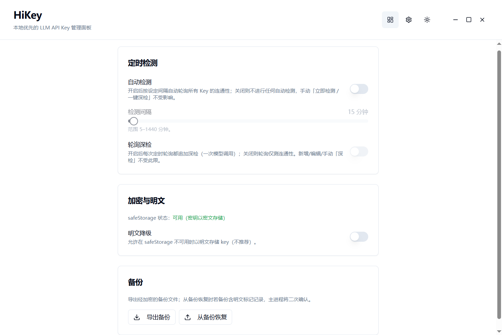

# HiKey

> A local-first, zero-cloud LLM API Key management panel with automatic health checks.

[]()
[]()
[]()
[]()

---

## Screenshots


*Main interface — Key list and status overview*


*Settings panel — theme, health check configuration, etc.*

---

## Features

| Feature | Description |
|---------|-------------|
| 🔐 **Secure Storage** | API Keys encrypted via Electron `safeStorage` (Windows DPAPI). No master password needed — OS-level encryption. |
| ❤️ **Health Checks** | One-click health check for all keys. Distinguishes **valid / invalid / rate-limited / insufficient balance** by provider error codes. |
| 📥 **Batch Import** | Import from `.env` / JSON files. Auto-categorizes by provider, detects duplicates with preview confirmation. |
| 📤 **Backup & Restore** | Export encrypted backups (preserving `safeStorage` encryption), restore on the same machine to prevent data loss. |
| 🏢 **Multi-Provider** | OpenAI, Anthropic, DeepSeek, Custom (any service compatible with the OpenAI protocol). |
| 🌗 **Dark Mode** | Follows system preference or manual toggle, fully adapted across all UI components. |
| 🪟 **Custom Title Bar** | Native window controls + custom title bar for a consistent Windows desktop experience. |

---

## Quick Start

### Prerequisites

- Node.js 18+
- npm 9+
- Windows 10+ (currently Windows-only)

### Install & Develop

```bash
# Clone the repository
git clone https://github.com/your-username/hikey.git
cd hikey

# Install dependencies
npm install

# Start dev mode (hot reload)
npm run dev

# Type checking
npm run typecheck

# Run tests
npm test
```

### Build & Package

```bash
# Build to out/
npm run build

# Build and package as Windows NSIS installer
npm run package
```

> `npm run dev` is wrapped by `scripts/dev.mjs`: it clears the `ELECTRON_RUN_AS_NODE` environment variable before startup (VS Code's integrated terminal inherits this variable, which causes Electron to fall back to plain Node and crash), so it works in both VS Code terminal and external terminals.

---

## Project Structure

```
HiKey/
├── electron/
│   ├── main/              # Main process
│   │   ├── index.ts       # Entry: window management, app lifecycle
│   │   ├── crypto.ts      # safeStorage encryption/decryption
│   │   ├── providers.ts   # Provider definitions & configuration
│   │   ├── storage/        # lowdb JSON storage layer
│   │   ├── keys/           # Key CRUD logic
│   │   ├── healthCheck/    # Health check engine
│   │   ├── import/         # Import parsing (.env / JSON)
│   │   ├── ipc/            # IPC handlers
│   │   └── backup/         # Backup export/restore
│   ├── preload/            # Preload scripts (contextBridge)
│   │   ├── index.ts        # Entry
│   │   ├── api.ts          # General API bridge
│   │   ├── keys.ts         # Key operations bridge
│   │   ├── settings.ts     # Settings bridge
│   │   ├── import.ts       # Import bridge
│   │   ├── backup.ts       # Backup bridge
│   │   ├── window.ts       # Window control bridge
│   │   └── system.ts       # System info bridge
├── src/
│   ├── main.tsx            # React entry
│   ├── App.tsx             # Root component (routing/layout)
│   ├── components/         # UI components
│   │   ├── ui/             # shadcn/ui base components
│   │   ├── KeyTable.tsx    # Key list
│   │   ├── KeyRow.tsx      # Key row
│   │   ├── KeyFormDialog.tsx  # Add/edit dialog
│   │   ├── ImportDialog.tsx   # Import dialog
│   │   ├── ImportPreviewTable.tsx  # Import preview
│   │   ├── SettingsView.tsx    # Settings panel
│   │   ├── FilterBar.tsx       # Filter bar
│   │   ├── StatusBadge.tsx     # Status badge
│   │   ├── ProviderBadge.tsx   # Provider badge
│   │   ├── RevealDialog.tsx    # Reveal key plaintext
│   │   ├── DeleteConfirmDialog.tsx  # Delete confirmation
│   │   ├── TitleBar.tsx        # Custom title bar
│   │   └── ThemeToggle.tsx     # Theme toggle
│   ├── providers/          # React Context
│   │   ├── KeysProvider.tsx     # Key state management
│   │   ├── SettingsProvider.tsx # Settings management
│   │   └── ThemeProvider.tsx    # Theme management
│   ├── lib/                # Utilities
│   │   ├── format.ts       # Formatting
│   │   ├── status.ts       # Status mapping
│   │   ├── theme.ts        # Theme utilities
│   │   └── utils.ts        # General utilities
│   └── styles/
│       └── globals.css     # Global styles
├── shared/                 # Shared types between main & renderer
├── docs/
│   ├── PRD.md              # Product requirements (Chinese)
│   ├── 技术栈.md            # Tech stack details (Chinese)
│   └── 数据库设计.md         # Data model design (Chinese)
├── scripts/
│   ├── dev.mjs             # Dev startup script
│   └── package.mjs         # Packaging script
└── resources/              # App resources (icons, etc.)
```

---

## Tech Stack

| Layer | Technology |
|-------|------------|
| Framework | Electron + electron-vite (main / preload / renderer triple-target build) |
| Frontend | React 18 + TypeScript |
| UI | shadcn/ui + Tailwind CSS + Radix |
| Storage | lowdb (JSON file storage, zero native dependencies) |
| Encryption | Electron safeStorage (Windows DPAPI) |
| Testing | Vitest |
| Packaging | electron-builder (Windows NSIS) |

For detailed tech selection and dependency list, see [docs/技术栈.md](docs/技术栈.md) (Chinese). Product requirements: [docs/PRD.md](docs/PRD.md) (Chinese). Data model: [docs/数据库设计.md](docs/数据库设计.md) (Chinese).

---

## Security Model

HiKey follows a **local-first, zero-cloud** security principle:

1. **OS-Level Encryption**: API Keys are encrypted via Electron `safeStorage`, with keys managed by Windows DPAPI. The application never touches the master key.
2. **No Master Password**: No extra password layer — logging into Windows is your unlock.
3. **Encrypted Backups**: Backups preserve `safeStorage` encryption. Ciphertext can only be restored on the same machine.
4. **Plaintext Fallback**: When `safeStorage` is unavailable (e.g., Linux/WSL), falls back to plaintext storage with a warning flag on export.
5. **Zero Cloud Dependency**: All data stored in local JSON files. No data is ever uploaded.

---

## Network Mirror for China (Optional)

When Electron and electron-builder binary downloads are slow, inject mirror environment variables before install/package commands (Git Bash; for cmd use `set X=Y &&` syntax):

```bash
# First install
ELECTRON_MIRROR=https://npmmirror.com/mirrors/electron/ ELECTRON_BUILDER_BINARIES_MIRROR=https://npmmirror.com/mirrors/electron-builder-binaries/ npm install

# Packaging
ELECTRON_BUILDER_BINARIES_MIRROR=https://npmmirror.com/mirrors/electron-builder-binaries/ npm run package
```

> Not placed in `.npmrc`: npm 11+ warns on unrecognized keys. Inline injection only affects the intended commands without polluting dev/typecheck.

---

## Development Status

- ✅ M1–M5: Scaffolding / Storage+Encryption / Health Checks / Import / IPC+Preload — **Complete**
- ✅ M6: Full UI pipeline + dev mode verified + Windows NSIS packaging — **Complete**
- 🔄 M7: Acceptance testing & stability — **In Progress**
- 📊 Backend tests: **296 passing**

---

## License

This project is licensed under the MIT License. See [LICENSE](LICENSE) for details.
